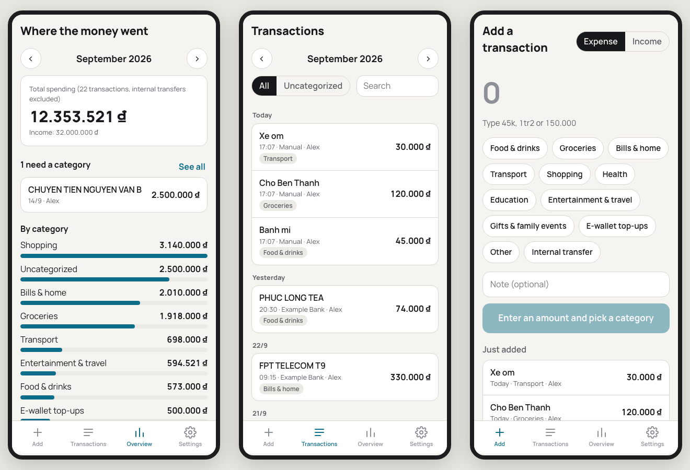
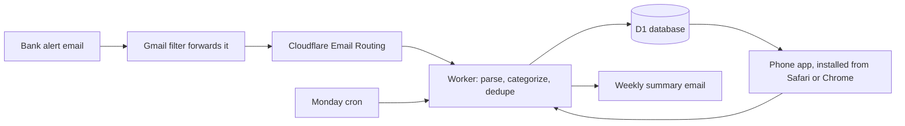

# inbox-ledger

**Zero-cost Finance Ops on the edge.** A household ledger that fills itself from bank alert emails. Your bank already emails you every transaction, so the ledger reads those emails, files each one under a category, and sends a summary every Monday. Cash and e-wallet spending takes three taps on the phone. It runs on Cloudflare's free tier, and your statements never pass through a third-party aggregator.



*The screens above run on fictional data from `Example Bank`, the sample parser that ships with the template.*

## How it works



- **Parse.** One small parser per bank reads the amount, direction, time and description from the alert. Emails that are not transaction alerts are ignored. An alert whose format changed is logged as an error, so nothing disappears silently.
- **Categorize.** Keyword rules, first match wins, ignoring case and Vietnamese accents: `phuc long` matches `PHÚC LONG COFFEE`. Unmatched spending under a threshold goes to *Small spending*, so only the big items need a decision. Transfers between the household's own accounts are *Internal transfer* and do not count as spending.
- **Foreign currency.** Card charges in USD and other currencies are converted at the day's rate, with a manual fallback rate in Settings.
- **Dedupe.** Each email's Message-ID is stored, so a re-forwarded alert is never counted twice.
- **Sign-in.** Type an email, receive a 6-digit code, stay signed in for a year. Only addresses on an allowlist get a code, and every other address gets the same answer, so the sign-in page reveals nothing.

## Why this shape

Budget apps that sync with a bank usually need your bank login, or a third-party aggregator that holds it. Bank alert emails are already in your inbox, usually arrive within seconds, and need no credentials at all. Forwarding them to an address you own keeps the whole pipeline in your own Cloudflare account.

The cost is zero because every piece fits in Cloudflare's free tier at household volume: a Worker, a D1 database, Email Routing, and the email binding that sends sign-in codes and the weekly summary.

## Set it up

You need a domain on Cloudflare and Node 20 or later.

```sh
npm install
npx wrangler login
npx wrangler d1 create inbox-ledger     # paste the printed database_id into wrangler.jsonc
npm run db:migrate
npx wrangler secret put ALLOWED_EMAILS  # comma-separated addresses that may sign in
```

1. In `wrangler.jsonc`, set your domain in `routes`, `APP_URL` and `MAIL_FROM`.
2. In Cloudflare **Email Routing** for your domain: enable it and add each member's address as a verified destination (sign-in codes are only sent to verified addresses). Then create a custom address such as `bank@yourdomain.com` with the action **Send to a Worker**, `inbox-ledger`.
3. `npm run deploy`.
4. In each member's Gmail: **Settings, Forwarding**, add `bank@yourdomain.com`. Gmail sends a confirmation code, which shows up in the app under **Settings, Bank emails received**. Then add a filter on your bank's alert sender that forwards to that address.
5. Open the app, go to **Settings**, and set each member's name and role. On a phone, add it to the home screen to use it like an app.

## Add your bank

The template ships with one parser, for the fictional `Example Bank`, in [`src/core/parsers/example-bank.ts`](src/core/parsers/example-bank.ts). To read your bank's alerts:

1. Copy it, match on your bank's alert subject line, and pull out the amount, direction, time and description.
2. Add a test with one of your real alerts, after replacing the account number, names and balance with made-up values.
3. Register it in [`src/core/parsers/index.ts`](src/core/parsers/index.ts), with the member role (`PRIMARY` or `PARTNER`) its emails belong to.

## Run it locally

```sh
printf 'DEV_EMAIL=you@example.com\n' > .dev.vars   # skip sign-in on your machine
npm run build
npm run db:migrate:local
npm run dev:worker                                # http://localhost:8787
```

Send it an email the way Email Routing would:

```sh
curl -X POST 'http://localhost:8787/cdn-cgi/handler/email?from=alerts%40example-bank.test&to=bank%40ledger.example.com' \
  --data-binary $'Subject: Example Bank: balance change alert\r\nMessage-ID: <1@test>\r\n\r\nAccount 0123xxx789 changed by -65,000 VND at 21/09/2026 08:10.\nDescription: HIGHLANDS COFFEE.\n'
```

`npm test` runs the parser, amount, categorization and email tests with Vitest.

## Privacy rules for contributors

- Never commit a real bank email. Fixtures use made-up account numbers, names, balances and amounts.
- Never commit `.dev.vars`.
- The only outside call the Worker makes is for exchange rates (open.er-api.com). It sends a currency code and nothing else.

## Stack

Cloudflare Workers with [Hono](https://hono.dev), D1 (SQLite), Email Routing and the email binding, [postal-mime](https://github.com/postalsys/postal-mime) for parsing, React with Vite for the phone app, Vitest for tests.

## License

MIT. Built by [Thinh Nguyen (Danny)](https://github.com/dannybosie). It started as the ledger his own household runs on.
